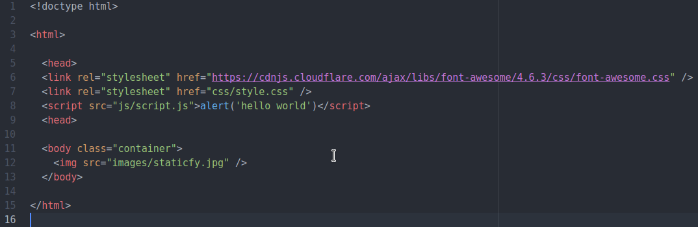
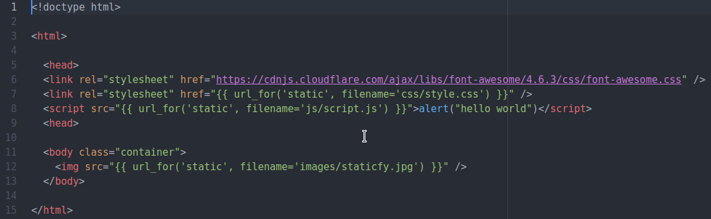
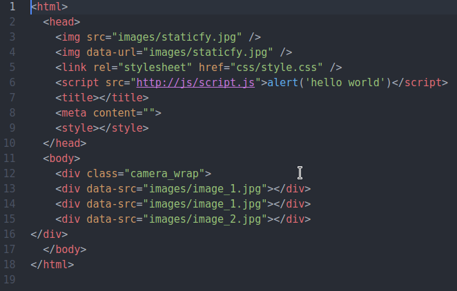
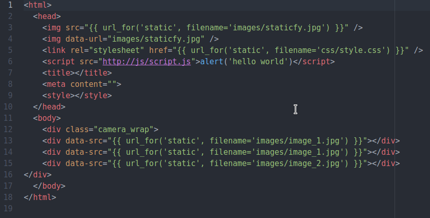
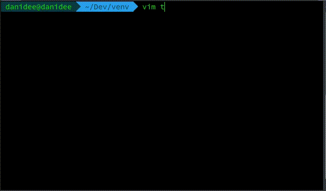

### Status
[](https://travis-ci.org/danidee10/Staticfy) [](https://codeclimate.com/github/danidee10/Staticfy)

# Staticfy
You just got a brand new template fron the front-end designer,  Everything's going well, Until you realize the amount of time you'll spend manually changing the links in the html templates you until all the static files and assets are properly linked and the file looks exactly like the demo he/she showed you.
with Staticfy you can save that time (and some of your hair) by automatically converting the static urls in your template to dynamic url's that wouldn't break if you decide to move your file to another location.

It transforms html links (in this example Flask) from this:

``

To this:

``

and then your web framework's templating language can resolve the tags to the right url.

# Get it in 10 seconds!
It's available as a package on PyPi so you can install it with

```bash
pip install staticfy
```
That's all!

Run it straight from the command line with:
```bash
staticfy staticfy.html --static-endpoint=static --add-tags='{"img": "data-url"}'
```

 `--static-endpoint` and `--add-tags` are optional

By default Staticfy writes to `stdout` but you can specify an output file with `-o` or `--output`

```bash
staticfy staticfy.html -o new.html
```

### Before Staticfying

---------------------------------------------------------------------------------------------------------------------------------
### After Staticfying


Notice how it preserves the font-awesome css link at the top of the file?, external resources (images, scripts, font-awesome, google-fonts, bootstrap files, disqus e.t.c) which aren't hosted locally with your website won't be staticfied. Staticfy also accepts an optional argument `--static-endpoint` in case you're not using the default static endpoint.

Staticy also preserves the indentation and formatting of any html file given to it, so your html file(s) are still look the same way and are still readablebe just the way they were before you staticfied them.

# Additional tags and attributes
By default staticfy identifies and staticfies the following tags:
 1. img tags with src attributes -- ``
 2. link tags with rel attributes -- `<link rel="" />`
 3. script tags with src attributes -- `<script src="" />`

But it's common these days for javascript libraries (for a slider or animation) that have link to images (mostly) or other static resources. you can easily staticfy those tags by specifying the `--add-tags` argument and passing in a valid JSON string, an example is this slider from http://www.pixedelic.com/plugins/camera/, you can staticfy the div tags like this:

```bash
staticfy staticfy.html --add-tags='{"div": "data-src"}'
```

Sure enough it gets staticfied.

### Before staticfying


### After staticfying


You can exclude certain tags you don't want to be staticfied by specifying the `--exc-tags` parameter, like `--add-tags` it expects a valid JSON string.

```bash
staticfy staticfy.html --exc-tags='{"img": "src"}'
```
Running that on a template should leave the img tags with the src attribute as they were in the original file.

It should be noted that sub folders containing html files won't be staticfied, only html files that exist in the specified directory will be staticfied. (this might change in the future)

Whenever you run staticfy on a template or on a folder, a staticfy folder is generated in the present working directory and the staticfied file(s) is placed in that folder, you also need to copy the file(s) over to the appropriate directory to overwrite the existing file with the new one.

# Namespacing
When your project gets big, It's necessary to namespace static assets to avoid name collision, you can achieve this by passing a string to the `--namespace` argument. The string would automatically be prepended to the url. For example in django

```bash
staticfy staticfy.html --namespace 'admin'
```

Would convert `` to this ``


# Inconsistency with single and double quotes in html
Staticfy also converts all single quoted html attributes to double quoted attributes. It's very common to see html files that look like this.

``` html

<html>

  <head>
    <link rel='stylesheet' href="https://cdnjs.cloudflare.com/ajax/libs/font-awesome/4.6.3/css/font-awesome.css" />
    
    
    <link rel="stylesheet" href='css/style.css' />
    <script src="/js/script.js"></script>
  </head>

</html>
```
You can easily fix all the inconsistencies by running staticfy on that file. There also *little* performance benefits to be gained when you gzip an html file that has consistent use of quotes (either double or single) against an inconsistent one. Don't believe it...Look at this



You can see a reduction from `219 bytes` to `204 bytes`, of course this difference is very little, but depending on how inconsistent and large your file is, you could save a save a few kilobytes which means faster page load times for your end users.

HTML is a very forgiving, and you're allowed to use single quotes or double quotes. but the double quotes are the **Unofficial Standard**

# Using staticfy with other frameworks
Staticfy was initially built with flask in mind, but it can also be extended to support other frameworks easily, out of the box it supports:
 1. flask
 2. django and
 3. laravel

For example to use staticfy with django specify `--framework=django`,
You can also set the environment variable `STATICFY_FRAMEWORK` to any supported framework, so you can avoid using `--framework` everytime. if you're running linux you can easily do this.

```bash
export STATICFY_FRAMEWORK=django
```

If you specify a framework that isn't found, staticfy would cry and gracefully fall back to it's flask roots.

# Tests
The tests are located in the `test.py` file and can be run with:

`python3 test.py`

# Python support
Staticfy supports both python2 and python3
**(python 2.7 >)**

# Requirements and 3rd party stuff
Beautiful soup 4
`pip3 install bs4`

You can use the requirements file `pip3 install -r requirements.txt`

If you have issues with importing HTML.parser on python 3.5, upgrade beautifulSoup:

`pip install --upgrade beautifulsoup4`

# Contribution
Pull requests and issues are highly welcome. I'm still looking to support as many web frameworks as possible.

Describe clearly what your PR attempts to fix (if it's a bug) or improve (If it's an existing feature).

If you want to add support for a new web framework, add the required pattern for the framework to the `frameworks` dictionary in `__config__.py`, make your tests pass and submit your Pull request.
